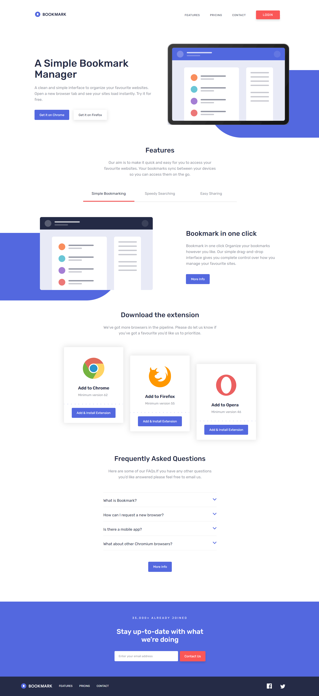

# Frontend Mentor - Bookmark landing page solution

This is a solution to the [Bookmark landing page challenge on Frontend Mentor](https://www.frontendmentor.io/challenges/bookmark-landing-page-5d0b588a9edda32581d29158). Frontend Mentor challenges help you improve your coding skills by building realistic projects.

## Table of contents

- [Overview](#overview)
  - [The challenge](#the-challenge)
  - [Screenshot](#screenshot)
  - [Links](#links)
- [My process](#my-process)
  - [Built with](#built-with)
  - [What I learned](#what-i-learned)
  - [Continued development](#continued-development)
- [Author](#author)

## Overview

### The challenge

Users should be able to:

- View the optimal layout for the site depending on their device's screen size
- See hover states for all interactive elements on the page
- Receive an error message when the newsletter form is submitted if:
  - The input field is empty
  - The email address is not formatted correctly

### Screenshot

### Links

- Live Site URL: [Live site of the challenge hosted here](https://jasonyang840723.
  github.io/bookmark-landing-page-master/)

## My process

### Built with

- Semantic HTML5 markup
- Javascript
- CSS custom properties
- Flexbox
- CSS Grid
- Desktop-first workflow

### What I learned

Familiar with manipulating dataset attribute on features section.

### Continued development

I will try to implement mobile-first workflow in future project.

## Author

- Website - Well I haven't made my profile portfolio, gonna make it sooon when I know a lot of stuffs
- Frontend Mentor - [@JasonYang840723](https://www.frontendmentor.io/profile/JasonYang840723)
